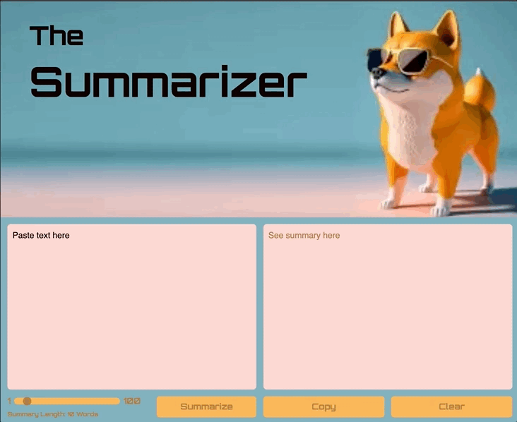

# The Summarizer Client
A web client for The Summarizer app, built with HTML, CSS, and JS. 

## In This Document:
  - [Live Application URL](#live-application-url)
  - [How to Use the Application](#how-to-use-the-application)
  - [Technologies Used](#technologies-used)
  - [Future Features:](#future-features)
  - [Challenges and Learning Points:](#challenges-and-learning-points)

## Live Application URL
[https://thesummarizer.pages.dev/](https://thesummarizer.pages.dev/)

## How to Use the Application
   
1. The user pastes a long text.
2. They choose the summary length using the slider.
3. They click on Summarize.
4. The summary displays.
5. They could copy the text.
6. They could clear and start over.

## Technologies Used
1. HTML, CSS, and JavaScript.

## Future Features:
1. Adding a Read functionality.

## Challenges and Learning Points:
1. I practiced deploying AI-powered applications to Cloudflare.
   

[Up](README.md)
